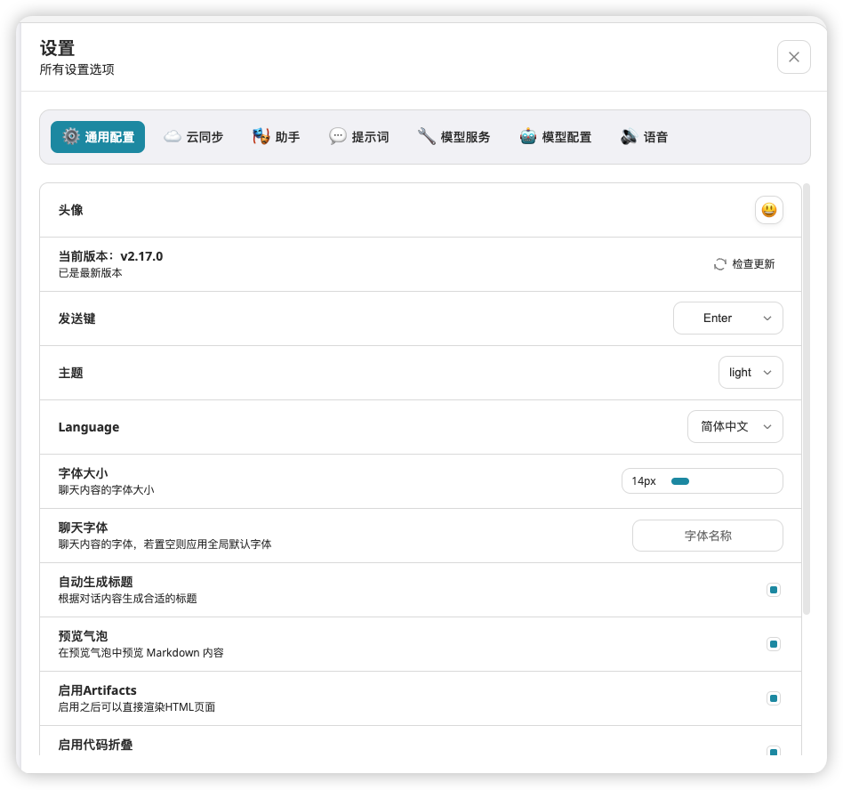
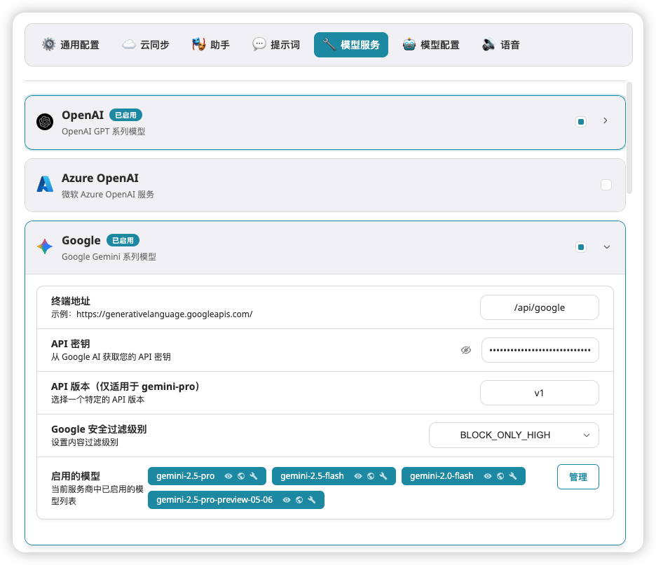
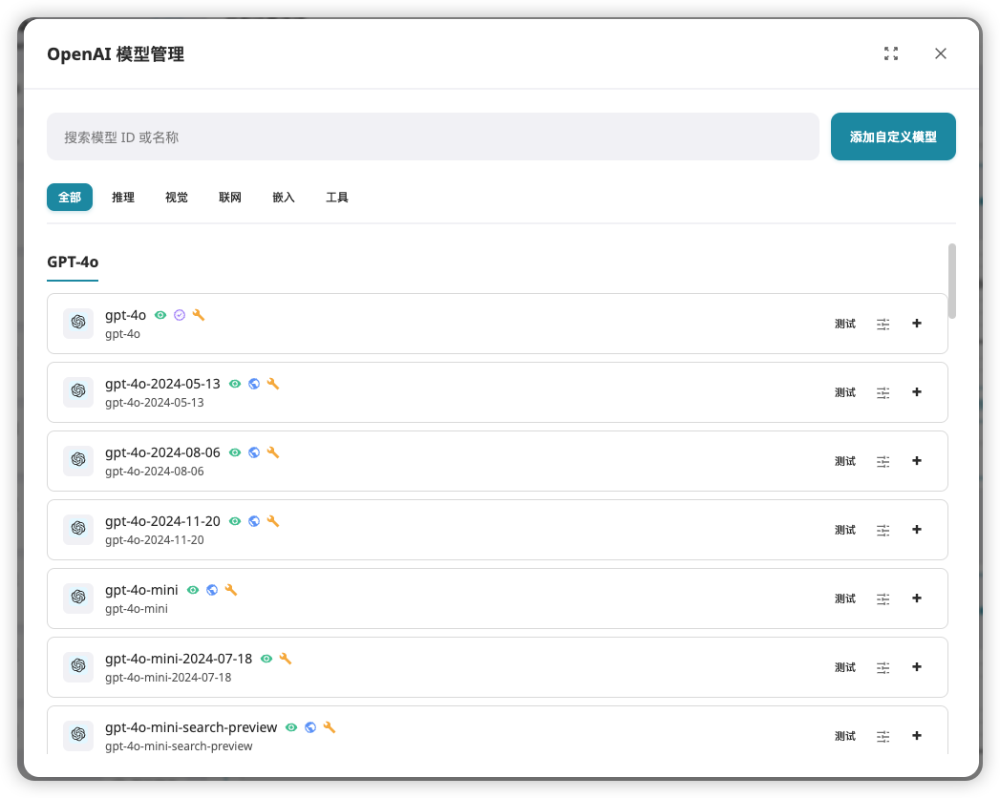
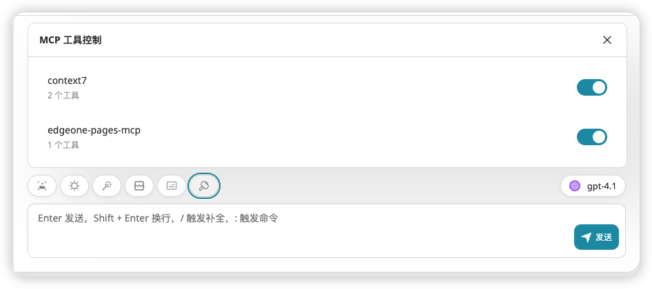
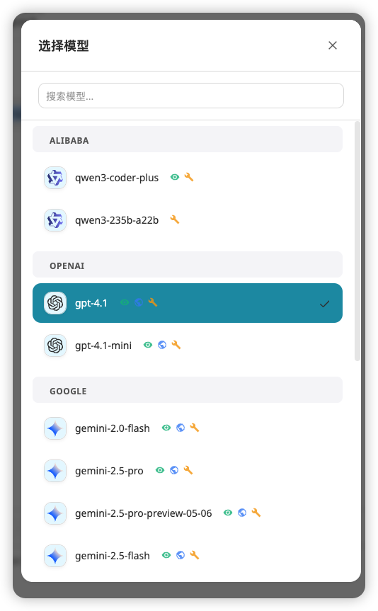
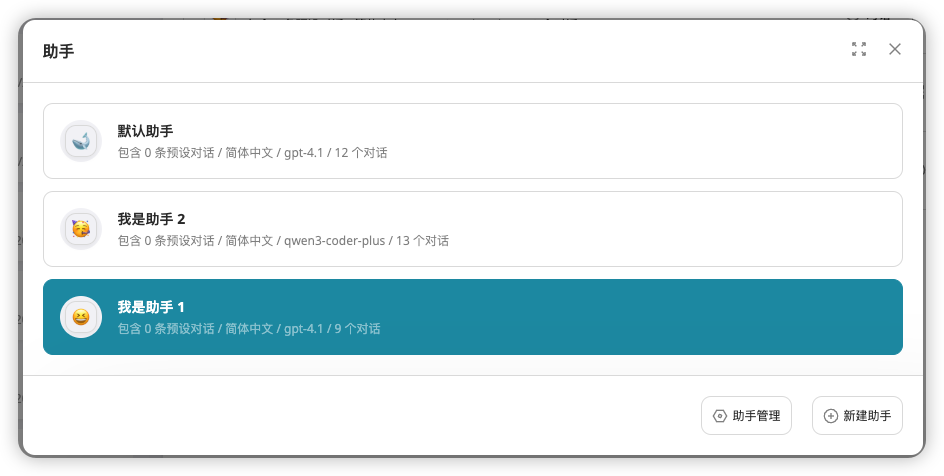
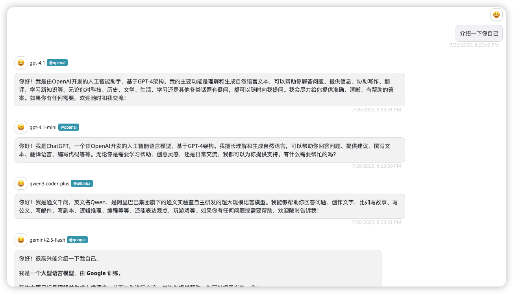
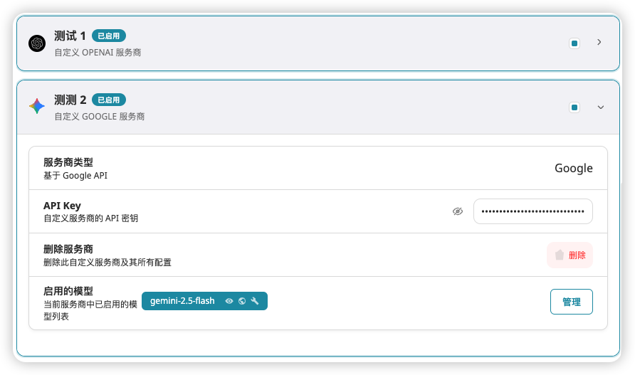

# QADChat

**基于原项目 [NextChat](https://github.com/ChatGPTNextWeb/NextChat) 的改造版本, 由 v2.16.0 版本 clone 后进行二次开发**

**包含部分 UI 重构，使用逻辑重构，无用模块移除等**

## 开始使用

### 部署

当前处于快速开发时期，暂不提供 docker 镜像等部署方式，可自行 clone 后通过源代码部署

由于重构了模型选择模块逻辑，故通过环境变量配置服务商的 API KEY功能可能存在问题，当前版本不保障可用性，推荐前端部署后，直接于设置中配置使用

### Demo站点

点击[https://qaduck.com](https://qaduck.com)

### 架构重构

- 将话题与助手(原名为“面具”)绑定，每个助手下的都拥有独立的话题列表，通过切换不同的助手，可以在该助手下快速创建话题。
  即原先整体架构为，话题-消息。该版本重构为助手-话题-消息。
  此重构有助于区分不同助手下的话题，避免所有话题均无条件展示，不便于浏览。同时增强了系统对于助手的依赖程度，能够更有效的利用助手提高效率。

### 用户体验升级

- 全局设置界面重构，清晰的设置分组，快速定位所需配置

- 模型服务重构与模型管理界面重构

  

  

- 一键快速启停 MCP Server

  

- 模型选择器 UI 与逻辑重构

  

- 助手选择界面重构

  
- 可配置的模型能力（视觉、联网、嵌入、工具、思考），通过小图标进行显示，快速浏览模型功能
- 支持模型连通性/可用性测试
- 去除所有原版推广内容
- 始终显示 MCP 功能模块
- 将聊天框上的 action 按钮修改为 ToolTip 的形式
- 固定显示当前使用模型，便于快速切换
- 移除搜索按钮，固定显示“搜索聊天记录”按钮
- 重构模型决策器，逻辑更加清晰，创建新对话时，优先使用当前助手配置的默认模型，若未配置，则使用全局默认模型

### 全新功能模块

- 模型竞技场，选择多个模型进行对话，对比模型之间的差异
  

- 自定义服务商
  

### MCP更新

- 使用当前主流的 streamableHttp 协议对当前 MCP 通信方式重构，同时兼容 sse 协议。便于后续扩展

- 将内置 MCP 列表修改为代码中嵌入，避免对远程服务的依赖。内置 Context7 和 EdgeOne Pages MCP

### 模块移除

- 移除插件模块，该模块功能与 MCP 高度重复，因此仅保留更为活跃的 MCP 服务
- 移除 SD 绘图模块，当前绘图模型较多，等待后续增加新的绘图界面

## 计划功能

- [ ] MCP 服务器添加面板
- [ ] 多文件类型上传支持
- [ ] 对话详细信息，如 qps 等内容显示
- [x] 多模型对话 ✅ **已完成**
- [ ] 环境变量支持
- [ ] 自部署支持、文档完善
- [ ] 模型/对话上下文统计

### Support

请通过 [Issue](https://github.com/Syferie/qadchat/issues) 来获取支持

## 致谢

- https://github.com/ChatGPTNextWeb/NextChat —— 项目的地基
- https://github.com/CherryHQ/cherry-studio —— 多处 UI、功能模块重构时参考其设计思路