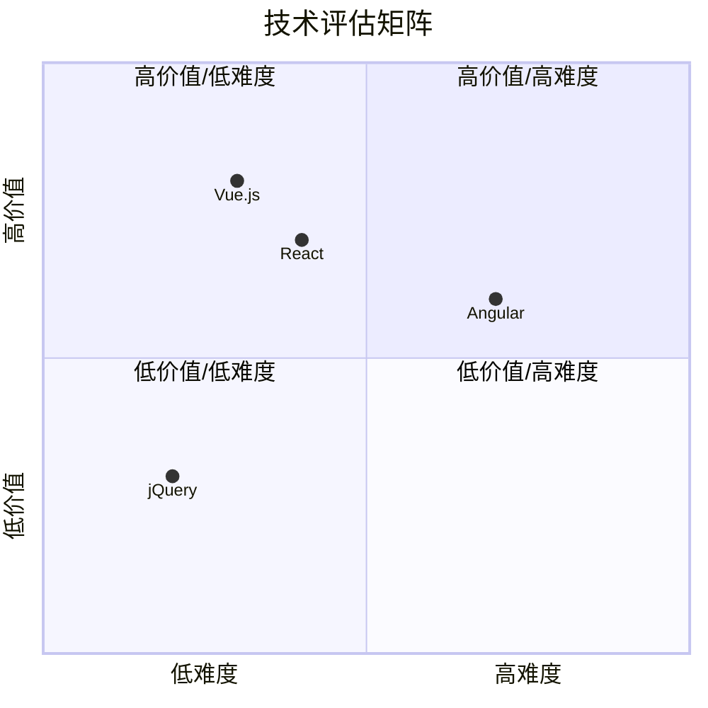

# 测试四象限图

```mermaid
quadrantChart
    title 技术评估矩阵
    x-axis 低难度 --> 高难度
    y-axis 低价值 --> 高价值
    quadrant-1 高价值/高难度
    quadrant-2 高价值/低难度
    quadrant-3 低价值/低难度
    quadrant-4 低价值/高难度
    "Vue.js": [0.3, 0.8]
    "React": [0.4, 0.7]
    "Angular": [0.7, 0.6]
    "jQuery": [0.2, 0.3]
```

这是一个四象限图的示例。
